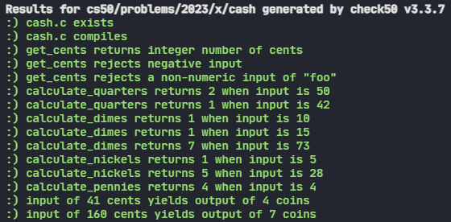

<body class="">

<h1>Cash</h1>

<h2>Greedy Algorithms</h2>

When making change, odds are you want to minimize the number of coins you’re dispensing for each customer, lest you run out (or annoy the customer!). Fortunately, computer science has given cashiers everywhere ways to minimize numbers of coins due: greedy algorithms.

According to the National Institute of Standards and Technology (NIST), a greedy algorithm is one “that always takes the best immediate, or local, solution while finding an answer. Greedy algorithms find the overall, or globally, optimal solution for some optimization problems, but may find less-than-optimal solutions for some instances of other problems.”

What’s all that mean? Well, suppose that a cashier owes a customer some change and in that cashier’s drawer are quarters (25¢), dimes (10¢), nickels (5¢), and pennies (1¢). The problem to be solved is to decide which coins and how many of each to hand to the customer. Think of a “greedy” cashier as one who wants to take the biggest bite out of this problem as possible with each coin they take out of the drawer. For instance, if some customer is owed 41¢, the biggest first (i.e., best immediate, or local) bite that can be taken is 25¢. (That bite is “best” inasmuch as it gets us closer to 0¢ faster than any other coin would.) Note that a bite of this size would whittle what was a 41¢ problem down to a 16¢ problem, since 41 - 25 = 16. That is, the remainder is a similar but smaller problem. Needless to say, another 25¢ bite would be too big (assuming the cashier prefers not to lose money), and so our greedy cashier would move on to a bite of size 10¢, leaving him or her with a 6¢ problem. At that point, greed calls for one 5¢ bite followed by one 1¢ bite, at which point the problem is solved. The customer receives one quarter, one dime, one nickel, and one penny: four coins in total.

It turns out that this greedy approach (i.e., algorithm) is not only locally optimal but also globally so for America’s currency (and also the European Union’s). That is, so long as a cashier has enough of each coin, this largest-to-smallest approach will yield the fewest coins possible. How few? Well, you tell us!

<h2>Implementation Details</h2>

In <code class="language-plaintext highlighter-rouge">cash.c</code>, we’ve implemented most (but not all!) of a program that prompts the user for the number of cents that a customer is owed and then prints the smallest number of coins with which that change can be made. Indeed, <code class="language-plaintext highlighter-rouge">main</code> is already implemented for you. But notice how <code class="language-plaintext highlighter-rouge">main</code> calls several functions that aren’t yet implemented! One of those functions, <code class="language-plaintext highlighter-rouge">get_cents</code>, takes no arguments (as indicated by <code class="language-plaintext highlighter-rouge">void</code>) and returns an <code class="language-plaintext highlighter-rouge">int</code>. The rest of the functions all take one argument, an <code class="language-plaintext highlighter-rouge">int</code>, and also return an <code class="language-plaintext highlighter-rouge">int</code>. All of them currently return <code class="language-plaintext highlighter-rouge">0</code> so that the code will compile. But you’ll want to replace every <code class="language-plaintext highlighter-rouge">TODO</code> and <code class="language-plaintext highlighter-rouge">return 0;</code> with your own code. Specifically, complete the implementation of those functions as follows:

<ul class="fa-ul">
<li data-marker="*"><i class="fas fa-square"></i>Implement <code class="language-plaintext highlighter-rouge">get_cents</code> in such a way that the function prompts the user for a number of cents using <code class="language-plaintext highlighter-rouge">get_int</code> and then returns that number as an <code class="language-plaintext highlighter-rouge">int</code>. If the user inputs a negative <code class="language-plaintext highlighter-rouge">int</code>, your code should prompt the user again. (But you don’t need to worry about the user inputting, e.g., a <code class="language-plaintext highlighter-rouge">string</code>, as <code class="language-plaintext highlighter-rouge">get_int</code> will take care of that for you.) Odds are you’ll find a <code class="language-plaintext highlighter-rouge">do while</code> loop of help, as in mario.c</code></li>
<li data-marker="*"><i class="fas fa-square"></i>Implement <code class="language-plaintext highlighter-rouge">calculate_quarters</code> in such a way that the function calculates (and returns as an <code class="language-plaintext highlighter-rouge">int</code>) how many quarters a customer should be given if they’re owed some number of cents. For instance, if <code class="language-plaintext highlighter-rouge">cents</code> is <code class="language-plaintext highlighter-rouge">25</code>, then <code class="language-plaintext highlighter-rouge">calculate_quarters</code> should return <code class="language-plaintext highlighter-rouge">1</code>. If <code class="language-plaintext highlighter-rouge">cents</code> is <code class="language-plaintext highlighter-rouge">26</code> or <code class="language-plaintext highlighter-rouge">49</code> (or anything in between, then <code class="language-plaintext highlighter-rouge">calculate_quarters</code> should also return <code class="language-plaintext highlighter-rouge">1</code>. If <code class="language-plaintext highlighter-rouge">cents</code> is <code class="language-plaintext highlighter-rouge">50</code> or <code class="language-plaintext highlighter-rouge">74</code> (or anything in between), then <code class="language-plaintext highlighter-rouge">calculate_quarters</code> should return <code class="language-plaintext highlighter-rouge">2</code>. And so forth.</li>
<li data-marker="*"><i class="fas fa-square"></i>Implement <code class="language-plaintext highlighter-rouge">calculate_dimes</code> in such a way that the function calculates the same for dimes.</li>
<li data-marker="*"><i class="fas fa-square"></i>Implement <code class="language-plaintext highlighter-rouge">calculate_nickels</code> in such a way that the function calculates the same for nickels.</li>
<li data-marker="*"><i class="fas fa-square"></i>Implement <code class="language-plaintext highlighter-rouge">calculate_pennies</code> in such a way that the function calculates the same for pennies.</li>
</ul>

Note that, unlike functions that only have side effects, functions that return a value should do so explicitly with <code class="language-plaintext highlighter-rouge">return</code>! Take care not to modify the distribution code itself, only replace the given <code class="language-plaintext highlighter-rouge">TODO</code>s and the subsequent <code class="language-plaintext highlighter-rouge">return</code> value!
Note too that, recalling the idea of abstraction, each of your calculate functions should accept any value of <code class="language-plaintext highlighter-rouge">cents</code> , not just those values that the greedy algorithm might suggest.  If <code class="language-plaintext highlighter-rouge">cents</code> is 85, for example,  <code class="language-plaintext highlighter-rouge">calculate_dimes</code> should return 8.

Your program should behave per the examples below.

<pre class="highlight"><code>$ ./cash
Change owed: 41
4
</code></pre>

<pre class="highlight"><code>$ ./cash
Change owed: -41
Change owed: foo
Change owed: 41
4
</code></pre>

<h3>How to Test Your Code</h3>

For this program, try testing your code manually–it’s good practice:

<ul class="fa-ul">
<li data-marker="*"><i class="fas fa-square"></i>If you input <code class="language-plaintext highlighter-rouge">-1</code>, does your program prompts you again?</li>
<li data-marker="*"><i class="fas fa-square"></i>If you input <code class="language-plaintext highlighter-rouge">0</code>, does your program output <code class="language-plaintext highlighter-rouge">0</code>?</li>
<li data-marker="*"><i class="fas fa-square"></i>If you input <code class="language-plaintext highlighter-rouge">1</code>, does your program output <code class="language-plaintext highlighter-rouge">1</code> (i.e., one penny)?</li>
<li data-marker="*"><i class="fas fa-square"></i>If you input <code class="language-plaintext highlighter-rouge">4</code>, does your program output <code class="language-plaintext highlighter-rouge">4</code> (i.e., four pennies)?</li>
<li data-marker="*"><i class="fas fa-square"></i>If you input <code class="language-plaintext highlighter-rouge">5</code>, does your program output <code class="language-plaintext highlighter-rouge">1</code> (i.e., one nickel)?</li>
<li data-marker="*"><i class="fas fa-square"></i>If you input <code class="language-plaintext highlighter-rouge">24</code>, does your program output <code class="language-plaintext highlighter-rouge">6</code> (i.e., two dimes and four pennies)?</li>
<li data-marker="*"><i class="fas fa-square"></i>If you input <code class="language-plaintext highlighter-rouge">25</code>, does your program output <code class="language-plaintext highlighter-rouge">1</code> (i.e., one quarter)?</li>
<li data-marker="*"><i class="fas fa-square"></i>If you input <code class="language-plaintext highlighter-rouge">26</code>, does your program output <code class="language-plaintext highlighter-rouge">2</code> (i.e., one quarter and one penny)?</li>
<li data-marker="*"><i class="fas fa-square"></i>If you input <code class="language-plaintext highlighter-rouge">99</code>, does your program output <code class="language-plaintext highlighter-rouge">9</code> (i.e., three quarters, two dimes, and four pennies)?</li>
</ul>

<h2>Results</h2>

</body>