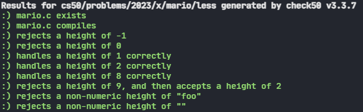

<html lang="en-us" class="wf-ptsans-n7-active wf-ptsans-n4-active wf-active">

<body class="">

<footer></footer>

</aside>

<main class="col-lg" style="margin-bottom: 870px; margin-top: 58px;">

<h1>Mario</h1>

<h2>World 1-1</h2>

Toward the end of World 1-1 in Nintendo’s Super Mario Brothers, Mario must ascend right-aligned pyramid of blocks, a la the below.

Let’s recreate that pyramid in C, albeit in text, using hashes (<code class="language-plaintext highlighter-rouge">#</code>) for bricks, a la the below. Each hash is a bit taller than it is wide, so the pyramid itself will also be taller than it is wide.

<pre class="highlight"><code>
#
##
###
####
#####
######
#######
########
</code></pre>

The program we’ll write will be called <code class="language-plaintext highlighter-rouge">mario</code>. And let’s allow the user to decide just how tall the pyramid should be by first prompting them for a positive integer between, say, 1 and 8, inclusive.

Here’s how the program might work if the user inputs <code class="language-plaintext highlighter-rouge">8</code> when prompted:

<pre class="highlight"><code>$ ./mario
Height: 8
#
##
###
####
#####
######
#######
########
</code></pre>

Here’s how the program might work if the user inputs <code class="language-plaintext highlighter-rouge">4</code> when prompted:

<pre class="highlight"><code>$ ./mario
Height: 4
#
##
###
####
</code></pre>

Here’s how the program might work if the user inputs <code class="language-plaintext highlighter-rouge">2</code> when prompted:

<pre class="highlight"><code>$ ./mario
Height: 2
#
##
</code></pre>

And here’s how the program might work if the user inputs <code class="language-plaintext highlighter-rouge">1</code> when prompted:

<pre class="highlight"><code>$ ./mario
Height: 1
#
</code></pre>

If the user doesn’t, in fact, input a positive integer between 1 and 8, inclusive, when prompted, the program should re-prompt the user until they cooperate:

<pre class="highlight"><code>$ ./mario
Height: -1
Height: 0
Height: 42
Height: 50
Height: 4
#
##
###
####
</code></pre>

How to begin? Let’s approach this problem one step at a time.

<h2>Walkthrough</h2>

<iframe allow="accelerometer; autoplay; encrypted-media; gyroscope; picture-in-picture" allowfullscreen="" class="border" data-video="" src="https://www.youtube.com/embed/NAs4FIWkJ4s?modestbranding=0&amp;rel=0&amp;showinfo=0" scrolling="no" id="iFrameResizer0" style="overflow: hidden;"></iframe>

<h2>Prompting for Input</h2>

Whatever your pseudocode, let’s first write only the C code that prompts (and re-prompts, as needed) the user for input. Open the file called <code class="language-plaintext highlighter-rouge">mario.c</code> inside of your <code class="language-plaintext highlighter-rouge">mario</code> directory. (Remember how?)

Now, modify <code class="language-plaintext highlighter-rouge">mario.c</code> in such a way that it prompts the user for the pyramid’s height, storing their input in a variable, re-prompting the user again and again as needed if their input is not a positive integer between 1 and 8, inclusive. Then, simply print the value of that variable, thereby confirming (for yourself) that you’ve indeed stored the user’s input successfully, a la the below.

<pre class="highlight"><code>$ ./mario
Height: -1
Height: 0
Height: 42
Height: 50
Height: 4
Stored: 4
</code></pre>

Hints
<ul class="fa-ul">
<li data-marker="*"><i class="fas fa-square"></i>Recall that you can compile your program with <code class="language-plaintext highlighter-rouge">make</code>.</li>
<li data-marker="*"><i class="fas fa-square"></i>Recall that you can print an <code class="language-plaintext highlighter-rouge">int</code> with <code class="language-plaintext highlighter-rouge">printf</code> using <code class="language-plaintext highlighter-rouge">%i</code>.</li>
<li data-marker="*"><i class="fas fa-square"></i>Recall that you can get an integer from the user with <code class="language-plaintext highlighter-rouge">get_int</code>.</li>
<li data-marker="*"><i class="fas fa-square"></i>Recall that <code class="language-plaintext highlighter-rouge">get_int</code> is declared in <code class="language-plaintext highlighter-rouge">cs50.h</code>.</li>
<li data-marker="*"><i class="fas fa-square"></i>Recall that we prompted the user for a positive integer in lecture using a <code class="language-plaintext highlighter-rouge">do while</code> loop in <a href="https://cdn.cs50.net/2022/fall/lectures/1/src1/mario8.c?highlight"><code class="language-plaintext highlighter-rouge">mario.c</code></a>.</li>
</ul>

<h2>Building the Opposite</h2>

Now that your program is (hopefully!) accepting input as prescribed, it’s time for another step.

It turns out it’s a bit easier to build a left-aligned pyramid than right-, a la the below.

<pre class="highlight"><code>#
##
###
####
#####
######
#######
########
</code></pre>

So let’s build a left-aligned pyramid first and then, once that’s working, right-align it instead!

Modify <code class="language-plaintext highlighter-rouge">mario.c</code> at right such that it no longer simply prints the user’s input but instead prints a left-aligned pyramid of that height.

Hints
<ul class="fa-ul">
<li data-marker="*"><i class="fas fa-square"></i>Keep in mind that a hash is just a character like any other, so you can print it with <code class="language-plaintext highlighter-rouge">printf</code>.</li>
<li data-marker="*"><i class="fas fa-square"></i>Just as Scratch has a <a href="https://docs.google.com/presentation/d/1mRIN6EDK92NJJlazpFfBNKhxrAQUUxJOJW0UH7knS0g/edit#slide=id.gee4e5a99f9_0_313"><code class="language-plaintext highlighter-rouge">repeat</code></a> block, so does C have a <a href="https://docs.google.com/presentation/d/1mRIN6EDK92NJJlazpFfBNKhxrAQUUxJOJW0UH7knS0g/edit#slide=id.gee4e5a99f9_0_313"><code class="language-plaintext highlighter-rouge">for</code></a> loop, via which you can iterate some number times. Perhaps on each iteration, <em>i</em>, you could print that many hashes?</li>
<li data-marker="*"><i class="fas fa-square"></i>

You can actually “nest” loops, iterating with one variable (e.g., <code class="language-plaintext highlighter-rouge">i</code>) in the “outer” loop and another (e.g., <code class="language-plaintext highlighter-rouge">j</code>) in the “inner” loop. For instance, here’s how you might print a square of height and width <code class="language-plaintext highlighter-rouge">n</code>, below. Of course, it’s not a square that you want to print!

<pre class="highlight"><code>  for (int i = 0; i &lt; n; i++)
{
for (int j = 0; j &lt; n; j++)
{
printf("#");
}
printf("\n");
}
</code></pre>
    

</li>
</ul>

<h2>Right-Aligning with Dots</h2>

Let’s now right-align that pyramid by pushing its hashes to the right by prefixing them with dots (i.e., periods), a la the below.

<pre class="highlight"><code>.......#
......##
.....###
....####
...#####
..######
.#######
########
</code></pre>

Modify <code class="language-plaintext highlighter-rouge">mario.c</code> in such a way that it does exactly that!

Hint

Notice how the number of dots needed on each line is the “opposite” of the number of that line’s hashes. For a pyramid of height 8, like the above, the first line has but 1 hash and thus 7 dots. The bottom line, meanwhile, has 8 hashes and thus 0 dots. Via what formula (or arithmetic, really) could you print that many dots?

<h3>How to Test Your Code</h3>

Does your code work as prescribed when you input

<ul class="fa-ul">
<li data-marker="*"><i class="fas fa-square"></i><code class="language-plaintext highlighter-rouge">-1</code> (or other negative numbers)?</li>
<li data-marker="*"><i class="fas fa-square"></i><code class="language-plaintext highlighter-rouge">0</code>?</li>
<li data-marker="*"><i class="fas fa-square"></i><code class="language-plaintext highlighter-rouge">1</code> through <code class="language-plaintext highlighter-rouge">8</code>?</li>
<li data-marker="*"><i class="fas fa-square"></i><code class="language-plaintext highlighter-rouge">9</code> or other positive numbers?</li>
<li data-marker="*"><i class="fas fa-square"></i>letters or words?</li>
<li data-marker="*"><i class="fas fa-square"></i>no input at all, when you only hit Enter?</li>
</ul>

<h2>Removing the Dots</h2>

All that remains now is a finishing flourish! Modify <code class="language-plaintext highlighter-rouge">mario.c</code> in such a way that it prints spaces instead of those dots!

<h2>Results</h2>

</body>