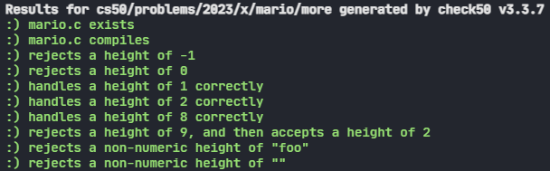

<body class="">

<main class="col-lg" style="margin-bottom: 870px; margin-top: 58px;">
<h1>Mario</h1>

<h2>World 1-1</h2>

Toward the beginning of World 1-1 in Nintendo’s Super Mario Brothers, Mario must hop over adjacent pyramids of blocks, per the below.

Let’s recreate those pyramids in C, albeit in text, using hashes (<code class="language-plaintext highlighter-rouge">#</code>) for bricks, a la the below. Each hash is a bit taller than it is wide, so the pyramids themselves will also be taller than they are wide.

<pre class="highlight"><code>   #  #
  ##  ##
 ###  ###
####  ####
</code></pre>

The program we’ll write will be called <code class="language-plaintext highlighter-rouge">mario</code>. And let’s allow the user to decide just how tall the pyramids should be by first prompting them for a positive integer between, say, 1 and 8, inclusive.

Here’s how the program might work if the user inputs <code class="language-plaintext highlighter-rouge">8</code> when prompted:

<pre class="highlight"><code>$ ./mario
Height: 8
       #  #
      ##  ##
     ###  ###
    ####  ####
   #####  #####
  ######  ######
 #######  #######
########  ########

</code></pre>

Here’s how the program might work if the user inputs <code class="language-plaintext highlighter-rouge">4</code> when prompted:

<pre class="highlight"><code>$ ./mario
Height: 4
   #  #
  ##  ##
 ###  ###
####  ####
</code></pre>

Here’s how the program might work if the user inputs <code class="language-plaintext highlighter-rouge">2</code> when prompted:

<pre class="highlight"><code>$ ./mario
Height: 2
 #  #
##  ##
</code></pre>

And here’s how the program might work if the user inputs <code class="language-plaintext highlighter-rouge">1</code> when prompted:

<pre class="highlight"><code>$ ./mario
Height: 1
#  #
</code></pre>

If the user doesn’t, in fact, input a positive integer between 1 and 8, inclusive, when prompted, the program should re-prompt the user until they cooperate:

<pre class="highlight"><code>$ ./mario
Height: -1
Height: 0
Height: 42
Height: 50
Height: 4
   #  #
  ##  ##
 ###  ###
####  ####
</code></pre>

Notice that width of the “gap” between adjacent pyramids is equal to the width of two hashes, irrespective of the pyramids’ heights.

Open your <code class="language-plaintext highlighter-rouge">mario.c</code> file to implement this problem as described!

<h3>Walkthrough</h3>

<iframe allow="accelerometer; autoplay; encrypted-media; gyroscope; picture-in-picture" allowfullscreen="" class="border" data-video="" src="https://www.youtube.com/embed/FzN9RAjYG_Q?modestbranding=0&amp;rel=0&amp;showinfo=0" scrolling="no" id="iFrameResizer0" style="overflow: hidden;"></iframe>

<h3>How to Test Your Code</h3>

Does your code work as prescribed when you input

<ul class="fa-ul">
<li data-marker="*"><i class="fas fa-square"></i><code class="language-plaintext highlighter-rouge">-1</code> (or other negative numbers)?</li>
<li data-marker="*"><i class="fas fa-square"></i><code class="language-plaintext highlighter-rouge">0</code>?</li>
<li data-marker="*"><i class="fas fa-square"></i><code class="language-plaintext highlighter-rouge">1</code> through <code class="language-plaintext highlighter-rouge">8</code>?</li>
<li data-marker="*"><i class="fas fa-square"></i><code class="language-plaintext highlighter-rouge">9</code> or other positive numbers?</li>
<li data-marker="*"><i class="fas fa-square"></i>letters or words?</li>
<li data-marker="*"><i class="fas fa-square"></i>no input at all, when you only hit Enter?</li>
</ul>

## Results

</body>