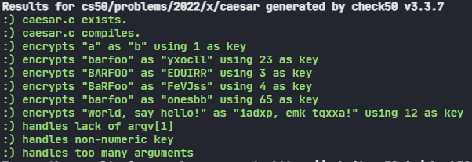

<body class="">

<h1>Caesar</h1>

<h2><a data-id="" href="#background">Background</a></h2>

Supposedly, Caesar (yes, that Caesar) used to “encrypt” (i.e., conceal in a reversible way) confidential messages by shifting each letter therein by some number of places. For instance, he might write A as B, B as C, C as D, …, and, wrapping around alphabetically, Z as A. And so, to say HELLO to someone, Caesar might write IFMMP instead. Upon receiving such messages from Caesar, recipients would have to “decrypt” them by shifting letters in the opposite direction by the same number of places.

The secrecy of this “cryptosystem” relied on only Caesar and the recipients knowing a secret, the number of places by which Caesar had shifted his letters (e.g., 1). Not particularly secure by modern standards, but, hey, if you’re perhaps the first in the world to do it, pretty secure!

Unencrypted text is generally called <em>plaintext</em>. Encrypted text is generally called <em>ciphertext</em>. And the secret used is called a <em>key</em>.

To be clear, then, here’s how encrypting <code class="language-plaintext highlighter-rouge">HELLO</code> with a key of <mjx-container class="MathJax CtxtMenu_Attached_0" jax="CHTML" tabindex="0" ctxtmenu_counter="0" style="font-size: 101.1%; position: relative;"><mjx-math class="MJX-TEX" aria-hidden="true"><mjx-mn class="mjx-n"><mjx-c class="mjx-c31"></mjx-c></mjx-mn></mjx-math><mjx-assistive-mml unselectable="on" display="inline"><math xmlns="http://www.w3.org/1998/Math/MathML"><mn>1</mn></math></mjx-assistive-mml></mjx-container> yields <code class="language-plaintext highlighter-rouge">IFMMP</code>:

<table></table>

Loading, please wait

<table class="table table-bordered table-striped" style="margin-top: 0px;">
<thead style=""><tr><th style="" data-field="0">

plaintext

</th><th style="" data-field="1">

<code class="language-plaintext highlighter-rouge">H</code>

</th><th style="" data-field="2">

<code class="language-plaintext highlighter-rouge">E</code>

</th><th style="" data-field="3">

<code class="language-plaintext highlighter-rouge">L</code>

</th><th style="" data-field="4">

<code class="language-plaintext highlighter-rouge">L</code>

</th><th style="" data-field="5">

<code class="language-plaintext highlighter-rouge">O</code>

</th></tr></thead>
<tbody><tr data-index="0"><td>+ key</td><td><mjx-container class="MathJax CtxtMenu_Attached_0" jax="CHTML" tabindex="0" ctxtmenu_counter="1" style="font-size: 101.1%; position: relative;"><mjx-math class="MJX-TEX" aria-hidden="true"><mjx-mn class="mjx-n"><mjx-c class="mjx-c31"></mjx-c></mjx-mn></mjx-math><mjx-assistive-mml unselectable="on" display="inline"><math xmlns="http://www.w3.org/1998/Math/MathML"><mn>1</mn></math></mjx-assistive-mml></mjx-container></td><td><mjx-container class="MathJax CtxtMenu_Attached_0" jax="CHTML" tabindex="0" ctxtmenu_counter="2" style="font-size: 101.1%; position: relative;"><mjx-math class="MJX-TEX" aria-hidden="true"><mjx-mn class="mjx-n"><mjx-c class="mjx-c31"></mjx-c></mjx-mn></mjx-math><mjx-assistive-mml unselectable="on" display="inline"><math xmlns="http://www.w3.org/1998/Math/MathML"><mn>1</mn></math></mjx-assistive-mml></mjx-container></td><td><mjx-container class="MathJax CtxtMenu_Attached_0" jax="CHTML" tabindex="0" ctxtmenu_counter="3" style="font-size: 101.1%; position: relative;"><mjx-math class="MJX-TEX" aria-hidden="true"><mjx-mn class="mjx-n"><mjx-c class="mjx-c31"></mjx-c></mjx-mn></mjx-math><mjx-assistive-mml unselectable="on" display="inline"><math xmlns="http://www.w3.org/1998/Math/MathML"><mn>1</mn></math></mjx-assistive-mml></mjx-container></td><td><mjx-container class="MathJax CtxtMenu_Attached_0" jax="CHTML" tabindex="0" ctxtmenu_counter="4" style="font-size: 101.1%; position: relative;"><mjx-math class="MJX-TEX" aria-hidden="true"><mjx-mn class="mjx-n"><mjx-c class="mjx-c31"></mjx-c></mjx-mn></mjx-math><mjx-assistive-mml unselectable="on" display="inline"><math xmlns="http://www.w3.org/1998/Math/MathML"><mn>1</mn></math></mjx-assistive-mml></mjx-container></td><td><mjx-container class="MathJax CtxtMenu_Attached_0" jax="CHTML" tabindex="0" ctxtmenu_counter="5" style="font-size: 101.1%; position: relative;"><mjx-math class="MJX-TEX" aria-hidden="true"><mjx-mn class="mjx-n"><mjx-c class="mjx-c31"></mjx-c></mjx-mn></mjx-math><mjx-assistive-mml unselectable="on" display="inline"><math xmlns="http://www.w3.org/1998/Math/MathML"><mn>1</mn></math></mjx-assistive-mml></mjx-container></td></tr><tr data-index="1"><td>= ciphertext</td><td><code class="language-plaintext highlighter-rouge">I</code></td><td><code class="language-plaintext highlighter-rouge">F</code></td><td><code class="language-plaintext highlighter-rouge">M</code></td><td><code class="language-plaintext highlighter-rouge">M</code></td><td><code class="language-plaintext highlighter-rouge">P</code></td></tr></tbody>
</table>

More formally, Caesar’s algorithm (i.e., cipher) encrypts messages by “rotating” each letter by <mjx-container class="MathJax CtxtMenu_Attached_0" jax="CHTML" tabindex="0" ctxtmenu_counter="6" style="font-size: 101.1%; position: relative;"><mjx-math class="MJX-TEX" aria-hidden="true"><mjx-mi class="mjx-i"><mjx-c class="mjx-c1D458 TEX-I"></mjx-c></mjx-mi></mjx-math><mjx-assistive-mml unselectable="on" display="inline"><math xmlns="http://www.w3.org/1998/Math/MathML"><mi>k</mi></math></mjx-assistive-mml></mjx-container> positions. More formally, if <mjx-container class="MathJax CtxtMenu_Attached_0" jax="CHTML" tabindex="0" ctxtmenu_counter="7" style="font-size: 101.1%; position: relative;"><mjx-math class="MJX-TEX" aria-hidden="true"><mjx-mi class="mjx-i"><mjx-c class="mjx-c1D45D TEX-I"></mjx-c></mjx-mi></mjx-math><mjx-assistive-mml unselectable="on" display="inline"><math xmlns="http://www.w3.org/1998/Math/MathML"><mi>p</mi></math></mjx-assistive-mml></mjx-container> is some plaintext (i.e., an unencrypted message), <mjx-container class="MathJax CtxtMenu_Attached_0" jax="CHTML" tabindex="0" ctxtmenu_counter="8" style="font-size: 101.1%; position: relative;"><mjx-math class="MJX-TEX" aria-hidden="true"><mjx-msub><mjx-mi class="mjx-i"><mjx-c class="mjx-c1D45D TEX-I"></mjx-c></mjx-mi><mjx-script style="vertical-align: -0.15em;"><mjx-mi class="mjx-i" size="s"><mjx-c class="mjx-c1D456 TEX-I"></mjx-c></mjx-mi></mjx-script></mjx-msub></mjx-math><mjx-assistive-mml unselectable="on" display="inline"><math xmlns="http://www.w3.org/1998/Math/MathML"><msub><mi>p</mi><mi>i</mi></msub></math></mjx-assistive-mml></mjx-container> is the <mjx-container class="MathJax CtxtMenu_Attached_0" jax="CHTML" tabindex="0" ctxtmenu_counter="9" style="font-size: 101.1%; position: relative;"><mjx-math class="MJX-TEX" aria-hidden="true"><mjx-msup><mjx-mi class="mjx-i"><mjx-c class="mjx-c1D456 TEX-I"></mjx-c></mjx-mi><mjx-script style="vertical-align: 0.363em;"><mjx-texatom size="s" texclass="ORD"><mjx-mi class="mjx-i"><mjx-c class="mjx-c1D461 TEX-I"></mjx-c></mjx-mi><mjx-mi class="mjx-i"><mjx-c class="mjx-c210E TEX-I"></mjx-c></mjx-mi></mjx-texatom></mjx-script></mjx-msup></mjx-math><mjx-assistive-mml unselectable="on" display="inline"><math xmlns="http://www.w3.org/1998/Math/MathML"><msup><mi>i</mi><mrow data-mjx-texclass="ORD"><mi>t</mi><mi>h</mi></mrow></msup></math></mjx-assistive-mml></mjx-container> character in <mjx-container class="MathJax CtxtMenu_Attached_0" jax="CHTML" tabindex="0" ctxtmenu_counter="10" style="font-size: 101.1%; position: relative;"><mjx-math class="MJX-TEX" aria-hidden="true"><mjx-mi class="mjx-i"><mjx-c class="mjx-c1D45D TEX-I"></mjx-c></mjx-mi></mjx-math><mjx-assistive-mml unselectable="on" display="inline"><math xmlns="http://www.w3.org/1998/Math/MathML"><mi>p</mi></math></mjx-assistive-mml></mjx-container>, and <mjx-container class="MathJax CtxtMenu_Attached_0" jax="CHTML" tabindex="0" ctxtmenu_counter="11" style="font-size: 101.1%; position: relative;"><mjx-math class="MJX-TEX" aria-hidden="true"><mjx-mi class="mjx-i"><mjx-c class="mjx-c1D458 TEX-I"></mjx-c></mjx-mi></mjx-math><mjx-assistive-mml unselectable="on" display="inline"><math xmlns="http://www.w3.org/1998/Math/MathML"><mi>k</mi></math></mjx-assistive-mml></mjx-container> is a secret key (i.e., a non-negative integer), then each letter, <mjx-container class="MathJax CtxtMenu_Attached_0" jax="CHTML" tabindex="0" ctxtmenu_counter="12" style="font-size: 101.1%; position: relative;"><mjx-math class="MJX-TEX" aria-hidden="true"><mjx-msub><mjx-mi class="mjx-i"><mjx-c class="mjx-c1D450 TEX-I"></mjx-c></mjx-mi><mjx-script style="vertical-align: -0.15em;"><mjx-mi class="mjx-i" size="s"><mjx-c class="mjx-c1D456 TEX-I"></mjx-c></mjx-mi></mjx-script></mjx-msub></mjx-math><mjx-assistive-mml unselectable="on" display="inline"><math xmlns="http://www.w3.org/1998/Math/MathML"><msub><mi>c</mi><mi>i</mi></msub></math></mjx-assistive-mml></mjx-container>, in the ciphertext, <mjx-container class="MathJax CtxtMenu_Attached_0" jax="CHTML" tabindex="0" ctxtmenu_counter="13" style="font-size: 101.1%; position: relative;"><mjx-math class="MJX-TEX" aria-hidden="true"><mjx-mi class="mjx-i"><mjx-c class="mjx-c1D450 TEX-I"></mjx-c></mjx-mi></mjx-math><mjx-assistive-mml unselectable="on" display="inline"><math xmlns="http://www.w3.org/1998/Math/MathML"><mi>c</mi></math></mjx-assistive-mml></mjx-container>, is computed as

<mjx-container class="MathJax CtxtMenu_Attached_0" jax="CHTML" display="true" justify="left" tabindex="0" ctxtmenu_counter="14" style="font-size: 101.1%; position: relative;"><mjx-math display="true" class="MJX-TEX" aria-hidden="true" style="margin-left: 0px;"><mjx-msub><mjx-mi class="mjx-i"><mjx-c class="mjx-c1D450 TEX-I"></mjx-c></mjx-mi><mjx-script style="vertical-align: -0.15em;"><mjx-mi class="mjx-i" size="s"><mjx-c class="mjx-c1D456 TEX-I"></mjx-c></mjx-mi></mjx-script></mjx-msub><mjx-mo class="mjx-n" space="4"><mjx-c class="mjx-c3D"></mjx-c></mjx-mo><mjx-mo class="mjx-n" space="4"><mjx-c class="mjx-c28"></mjx-c></mjx-mo><mjx-msub><mjx-mi class="mjx-i"><mjx-c class="mjx-c1D45D TEX-I"></mjx-c></mjx-mi><mjx-script style="vertical-align: -0.15em;"><mjx-mi class="mjx-i" size="s"><mjx-c class="mjx-c1D456 TEX-I"></mjx-c></mjx-mi></mjx-script></mjx-msub><mjx-mo class="mjx-n" space="3"><mjx-c class="mjx-c2B"></mjx-c></mjx-mo><mjx-mi class="mjx-i" space="3"><mjx-c class="mjx-c1D458 TEX-I"></mjx-c></mjx-mi><mjx-mo class="mjx-n"><mjx-c class="mjx-c29"></mjx-c></mjx-mo><mjx-mi class="mjx-n"><mjx-c class="mjx-c25"></mjx-c></mjx-mi><mjx-mn class="mjx-n"><mjx-c class="mjx-c32"></mjx-c><mjx-c class="mjx-c36"></mjx-c></mjx-mn></mjx-math><mjx-assistive-mml unselectable="on" display="block"><math xmlns="http://www.w3.org/1998/Math/MathML" display="block"><msub><mi>c</mi><mi>i</mi></msub><mo>=</mo><mo stretchy="false">(</mo><msub><mi>p</mi><mi>i</mi></msub><mo>+</mo><mi>k</mi><mo stretchy="false">)</mo><mi mathvariant="normal">%</mi><mn>26</mn></math></mjx-assistive-mml></mjx-container>

wherein <mjx-container class="MathJax CtxtMenu_Attached_0" jax="CHTML" tabindex="0" ctxtmenu_counter="15" style="font-size: 101.1%; position: relative;"><mjx-math class="MJX-TEX" aria-hidden="true"><mjx-mi class="mjx-n"><mjx-c class="mjx-c25"></mjx-c></mjx-mi><mjx-mn class="mjx-n"><mjx-c class="mjx-c32"></mjx-c><mjx-c class="mjx-c36"></mjx-c></mjx-mn></mjx-math><mjx-assistive-mml unselectable="on" display="inline"><math xmlns="http://www.w3.org/1998/Math/MathML"><mi mathvariant="normal">%</mi><mn>26</mn></math></mjx-assistive-mml></mjx-container> here means “remainder when dividing by 26.” This formula perhaps makes the cipher seem more complicated than it is, but it’s really just a concise way of expressing the algorithm precisely. Indeed, for the sake of discussion, think of A (or a) as <mjx-container class="MathJax CtxtMenu_Attached_0" jax="CHTML" tabindex="0" ctxtmenu_counter="16" style="font-size: 101.1%; position: relative;"><mjx-math class="MJX-TEX" aria-hidden="true"><mjx-mn class="mjx-n"><mjx-c class="mjx-c30"></mjx-c></mjx-mn></mjx-math><mjx-assistive-mml unselectable="on" display="inline"><math xmlns="http://www.w3.org/1998/Math/MathML"><mn>0</mn></math></mjx-assistive-mml></mjx-container>, B (or b) as <mjx-container class="MathJax CtxtMenu_Attached_0" jax="CHTML" tabindex="0" ctxtmenu_counter="17" style="font-size: 101.1%; position: relative;"><mjx-math class="MJX-TEX" aria-hidden="true"><mjx-mn class="mjx-n"><mjx-c class="mjx-c31"></mjx-c></mjx-mn></mjx-math><mjx-assistive-mml unselectable="on" display="inline"><math xmlns="http://www.w3.org/1998/Math/MathML"><mn>1</mn></math></mjx-assistive-mml></mjx-container>, …, H (or h) as <mjx-container class="MathJax CtxtMenu_Attached_0" jax="CHTML" tabindex="0" ctxtmenu_counter="18" style="font-size: 101.1%; position: relative;"><mjx-math class="MJX-TEX" aria-hidden="true"><mjx-mn class="mjx-n"><mjx-c class="mjx-c37"></mjx-c></mjx-mn></mjx-math><mjx-assistive-mml unselectable="on" display="inline"><math xmlns="http://www.w3.org/1998/Math/MathML"><mn>7</mn></math></mjx-assistive-mml></mjx-container>, I (or i) as <mjx-container class="MathJax CtxtMenu_Attached_0" jax="CHTML" tabindex="0" ctxtmenu_counter="19" style="font-size: 101.1%; position: relative;"><mjx-math class="MJX-TEX" aria-hidden="true"><mjx-mn class="mjx-n"><mjx-c class="mjx-c38"></mjx-c></mjx-mn></mjx-math><mjx-assistive-mml unselectable="on" display="inline"><math xmlns="http://www.w3.org/1998/Math/MathML"><mn>8</mn></math></mjx-assistive-mml></mjx-container>, …, and Z (or z) as <mjx-container class="MathJax CtxtMenu_Attached_0" jax="CHTML" tabindex="0" ctxtmenu_counter="20" style="font-size: 101.1%; position: relative;"><mjx-math class="MJX-TEX" aria-hidden="true"><mjx-mn class="mjx-n"><mjx-c class="mjx-c32"></mjx-c><mjx-c class="mjx-c35"></mjx-c></mjx-mn></mjx-math><mjx-assistive-mml unselectable="on" display="inline"><math xmlns="http://www.w3.org/1998/Math/MathML"><mn>25</mn></math></mjx-assistive-mml></mjx-container>. Suppose that Caesar just wants to say <code class="language-plaintext highlighter-rouge">Hi</code> to someone confidentially using, this time, a key, <mjx-container class="MathJax CtxtMenu_Attached_0" jax="CHTML" tabindex="0" ctxtmenu_counter="21" style="font-size: 101.1%; position: relative;"><mjx-math class="MJX-TEX" aria-hidden="true"><mjx-mi class="mjx-i"><mjx-c class="mjx-c1D458 TEX-I"></mjx-c></mjx-mi></mjx-math><mjx-assistive-mml unselectable="on" display="inline"><math xmlns="http://www.w3.org/1998/Math/MathML"><mi>k</mi></math></mjx-assistive-mml></mjx-container>, of 3. And so his plaintext, <mjx-container class="MathJax CtxtMenu_Attached_0" jax="CHTML" tabindex="0" ctxtmenu_counter="22" style="font-size: 101.1%; position: relative;"><mjx-math class="MJX-TEX" aria-hidden="true"><mjx-mi class="mjx-i"><mjx-c class="mjx-c1D45D TEX-I"></mjx-c></mjx-mi></mjx-math><mjx-assistive-mml unselectable="on" display="inline"><math xmlns="http://www.w3.org/1998/Math/MathML"><mi>p</mi></math></mjx-assistive-mml></mjx-container>, is <code class="language-plaintext highlighter-rouge">Hi</code>, in which case his plaintext’s first character, <mjx-container class="MathJax CtxtMenu_Attached_0" jax="CHTML" tabindex="0" ctxtmenu_counter="23" style="font-size: 101.1%; position: relative;"><mjx-math class="MJX-TEX" aria-hidden="true"><mjx-msub><mjx-mi class="mjx-i"><mjx-c class="mjx-c1D45D TEX-I"></mjx-c></mjx-mi><mjx-script style="vertical-align: -0.15em;"><mjx-mn class="mjx-n" size="s"><mjx-c class="mjx-c30"></mjx-c></mjx-mn></mjx-script></mjx-msub></mjx-math><mjx-assistive-mml unselectable="on" display="inline"><math xmlns="http://www.w3.org/1998/Math/MathML"><msub><mi>p</mi><mn>0</mn></msub></math></mjx-assistive-mml></mjx-container>, is <code class="language-plaintext highlighter-rouge">H</code> (aka 7), and his plaintext’s second character, <mjx-container class="MathJax CtxtMenu_Attached_0" jax="CHTML" tabindex="0" ctxtmenu_counter="24" style="font-size: 101.1%; position: relative;"><mjx-math class="MJX-TEX" aria-hidden="true"><mjx-msub><mjx-mi class="mjx-i"><mjx-c class="mjx-c1D45D TEX-I"></mjx-c></mjx-mi><mjx-script style="vertical-align: -0.15em;"><mjx-mn class="mjx-n" size="s"><mjx-c class="mjx-c31"></mjx-c></mjx-mn></mjx-script></mjx-msub></mjx-math><mjx-assistive-mml unselectable="on" display="inline"><math xmlns="http://www.w3.org/1998/Math/MathML"><msub><mi>p</mi><mn>1</mn></msub></math></mjx-assistive-mml></mjx-container>, is <code class="language-plaintext highlighter-rouge">i</code> (aka 8). His ciphertext’s first character, <mjx-container class="MathJax CtxtMenu_Attached_0" jax="CHTML" tabindex="0" ctxtmenu_counter="25" style="font-size: 101.1%; position: relative;"><mjx-math class="MJX-TEX" aria-hidden="true"><mjx-msub><mjx-mi class="mjx-i"><mjx-c class="mjx-c1D450 TEX-I"></mjx-c></mjx-mi><mjx-script style="vertical-align: -0.15em;"><mjx-mn class="mjx-n" size="s"><mjx-c class="mjx-c30"></mjx-c></mjx-mn></mjx-script></mjx-msub></mjx-math><mjx-assistive-mml unselectable="on" display="inline"><math xmlns="http://www.w3.org/1998/Math/MathML"><msub><mi>c</mi><mn>0</mn></msub></math></mjx-assistive-mml></mjx-container>, is thus <code class="language-plaintext highlighter-rouge">K</code>, and his ciphertext’s second character, <mjx-container class="MathJax CtxtMenu_Attached_0" jax="CHTML" tabindex="0" ctxtmenu_counter="26" style="font-size: 101.1%; position: relative;"><mjx-math class="MJX-TEX" aria-hidden="true"><mjx-msub><mjx-mi class="mjx-i"><mjx-c class="mjx-c1D450 TEX-I"></mjx-c></mjx-mi><mjx-script style="vertical-align: -0.15em;"><mjx-mn class="mjx-n" size="s"><mjx-c class="mjx-c31"></mjx-c></mjx-mn></mjx-script></mjx-msub></mjx-math><mjx-assistive-mml unselectable="on" display="inline"><math xmlns="http://www.w3.org/1998/Math/MathML"><msub><mi>c</mi><mn>1</mn></msub></math></mjx-assistive-mml></mjx-container>, is thus <code class="language-plaintext highlighter-rouge">L</code>. Make sense?

Let’s write a program called <code class="language-plaintext highlighter-rouge">caesar</code> that enables you to encrypt messages using Caesar’s cipher. At the time the user executes the program, they should decide, by providing a command-line argument, what the key should be in the secret message they’ll provide at runtime. We shouldn’t necessarily assume that the user’s key is going to be a number; though you may assume that, if it is a number, it will be a positive integer.

Here are a few examples of how the program might work. For example, if the user inputs a key of <code class="language-plaintext highlighter-rouge">1</code> and a plaintext of <code class="language-plaintext highlighter-rouge">HELLO</code>:

<pre class="highlight"><code>$ ./caesar 1
plaintext:  HELLO
ciphertext: IFMMP
</code></pre>

Here’s how the program might work if the user provides a key of <code class="language-plaintext highlighter-rouge">13</code> and a plaintext of <code class="language-plaintext highlighter-rouge">hello, world</code>:

<pre class="highlight"><code>$ ./caesar 13
plaintext:  hello, world
ciphertext: uryyb, jbeyq
</code></pre>

Notice that neither the comma nor the space were “shifted” by the cipher. Only rotate alphabetical characters!

How about one more? Here’s how the program might work if the user provides a key of <code class="language-plaintext highlighter-rouge">13</code> again, with a more complex plaintext:

<pre class="highlight"><code>$ ./caesar 13
plaintext:  be sure to drink your Ovaltine
ciphertext: or fher gb qevax lbhe Binygvar
</code></pre>

Why?

<iframe allow="accelerometer; autoplay; encrypted-media; gyroscope; picture-in-picture" allowfullscreen="" class="border" data-video="" src="https://www.youtube.com/embed/9K4FsAHB-C8?modestbranding=0&amp;rel=0&amp;showinfo=0" scrolling="no" id="iFrameResizer0" style="overflow: hidden;"></iframe>

Notice that the case of the original message has been preserved. Lowercase letters remain lowercase, and uppercase letters remain uppercase.

And what if a user doesn’t cooperate, providing a command-line argument that isn’t a number? The program should remind the user how to use the program:

<pre class="highlight"><code>$ ./caesar HELLO
Usage: ./caesar key
</code></pre>

Or really doesn’t cooperate, providing no command-line argument at all? The program should remind the user how to use the program:

<pre class="highlight"><code>$ ./caesar
Usage: ./caesar key
</code></pre>

Or really, really doesn’t cooperate, providing more than one command-line argument? The program should remind the user how to use the program:

<pre class="highlight"><code>$ ./caesar 1 2 3
Usage: ./caesar key
</code></pre>

<h2>Specification</h2>

Design and implement a program, <code class="language-plaintext highlighter-rouge">caesar</code>, that encrypts messages using Caesar’s cipher.

<ul class="fa-ul">
<li data-marker="*"><i class="fas fa-square"></i>Implement your program in a file called <code class="language-plaintext highlighter-rouge">caesar.c</code> in a directory called <code class="language-plaintext highlighter-rouge">caesar</code>.</li>
<li data-marker="*"><i class="fas fa-square"></i>Your program must accept a single command-line argument, a non-negative integer. Let’s call it <mjx-container class="MathJax CtxtMenu_Attached_0" jax="CHTML" tabindex="0" ctxtmenu_counter="27" style="font-size: 101.1%; position: relative;"><mjx-math class="MJX-TEX" aria-hidden="true"><mjx-mi class="mjx-i"><mjx-c class="mjx-c1D458 TEX-I"></mjx-c></mjx-mi></mjx-math><mjx-assistive-mml unselectable="on" display="inline"><math xmlns="http://www.w3.org/1998/Math/MathML"><mi>k</mi></math></mjx-assistive-mml></mjx-container> for the sake of discussion.</li>
<li data-marker="*"><i class="fas fa-square"></i>If your program is executed without any command-line arguments or with more than one command-line argument, your program should print an error message of your choice (with <code class="language-plaintext highlighter-rouge">printf</code>) and return from <code class="language-plaintext highlighter-rouge">main</code> a value of <code class="language-plaintext highlighter-rouge">1</code> (which tends to signify an error) immediately.</li>
<li data-marker="*"><i class="fas fa-square"></i>If any of the characters of the command-line argument is not a decimal digit, your program should print the message <code class="language-plaintext highlighter-rouge">Usage: ./caesar key</code> and return from <code class="language-plaintext highlighter-rouge">main</code> a value of <code class="language-plaintext highlighter-rouge">1</code>.</li>
<li data-marker="*"><i class="fas fa-square"></i>Do not assume that <mjx-container class="MathJax CtxtMenu_Attached_0" jax="CHTML" tabindex="0" ctxtmenu_counter="28" style="font-size: 101.1%; position: relative;"><mjx-math class="MJX-TEX" aria-hidden="true"><mjx-mi class="mjx-i"><mjx-c class="mjx-c1D458 TEX-I"></mjx-c></mjx-mi></mjx-math><mjx-assistive-mml unselectable="on" display="inline"><math xmlns="http://www.w3.org/1998/Math/MathML"><mi>k</mi></math></mjx-assistive-mml></mjx-container> will be less than or equal to 26. Your program should work for all non-negative integral values of <mjx-container class="MathJax CtxtMenu_Attached_0" jax="CHTML" tabindex="0" ctxtmenu_counter="29" style="font-size: 101.1%; position: relative;"><mjx-math class="MJX-TEX" aria-hidden="true"><mjx-mi class="mjx-i"><mjx-c class="mjx-c1D458 TEX-I"></mjx-c></mjx-mi></mjx-math><mjx-assistive-mml unselectable="on" display="inline"><math xmlns="http://www.w3.org/1998/Math/MathML"><mi>k</mi></math></mjx-assistive-mml></mjx-container> less than <mjx-container class="MathJax CtxtMenu_Attached_0" jax="CHTML" tabindex="0" ctxtmenu_counter="30" style="font-size: 101.1%; position: relative;"><mjx-math class="MJX-TEX" aria-hidden="true"><mjx-msup><mjx-mn class="mjx-n"><mjx-c class="mjx-c32"></mjx-c></mjx-mn><mjx-script style="vertical-align: 0.363em;"><mjx-texatom size="s" texclass="ORD"><mjx-mn class="mjx-n"><mjx-c class="mjx-c33"></mjx-c><mjx-c class="mjx-c31"></mjx-c></mjx-mn></mjx-texatom></mjx-script></mjx-msup><mjx-mo class="mjx-n" space="3"><mjx-c class="mjx-c2212"></mjx-c></mjx-mo><mjx-mn class="mjx-n" space="3"><mjx-c class="mjx-c32"></mjx-c><mjx-c class="mjx-c36"></mjx-c></mjx-mn></mjx-math><mjx-assistive-mml unselectable="on" display="inline"><math xmlns="http://www.w3.org/1998/Math/MathML"><msup><mn>2</mn><mrow data-mjx-texclass="ORD"><mn>31</mn></mrow></msup><mo>−</mo><mn>26</mn></math></mjx-assistive-mml></mjx-container>. In other words, you don’t need to worry if your program eventually breaks if the user chooses a value for <mjx-container class="MathJax CtxtMenu_Attached_0" jax="CHTML" tabindex="0" ctxtmenu_counter="31" style="font-size: 101.1%; position: relative;"><mjx-math class="MJX-TEX" aria-hidden="true"><mjx-mi class="mjx-i"><mjx-c class="mjx-c1D458 TEX-I"></mjx-c></mjx-mi></mjx-math><mjx-assistive-mml unselectable="on" display="inline"><math xmlns="http://www.w3.org/1998/Math/MathML"><mi>k</mi></math></mjx-assistive-mml></mjx-container> that’s too big or almost too big to fit in an <code class="language-plaintext highlighter-rouge">int</code>. (Recall that an <code class="language-plaintext highlighter-rouge">int</code> can overflow.) But, even if <mjx-container class="MathJax CtxtMenu_Attached_0" jax="CHTML" tabindex="0" ctxtmenu_counter="32" style="font-size: 101.1%; position: relative;"><mjx-math class="MJX-TEX" aria-hidden="true"><mjx-mi class="mjx-i"><mjx-c class="mjx-c1D458 TEX-I"></mjx-c></mjx-mi></mjx-math><mjx-assistive-mml unselectable="on" display="inline"><math xmlns="http://www.w3.org/1998/Math/MathML"><mi>k</mi></math></mjx-assistive-mml></mjx-container> is greater than <mjx-container class="MathJax CtxtMenu_Attached_0" jax="CHTML" tabindex="0" ctxtmenu_counter="33" style="font-size: 101.1%; position: relative;"><mjx-math class="MJX-TEX" aria-hidden="true"><mjx-mn class="mjx-n"><mjx-c class="mjx-c32"></mjx-c><mjx-c class="mjx-c36"></mjx-c></mjx-mn></mjx-math><mjx-assistive-mml unselectable="on" display="inline"><math xmlns="http://www.w3.org/1998/Math/MathML"><mn>26</mn></math></mjx-assistive-mml></mjx-container>, alphabetical characters in your program’s input should remain alphabetical characters in your program’s output. For instance, if <mjx-container class="MathJax CtxtMenu_Attached_0" jax="CHTML" tabindex="0" ctxtmenu_counter="34" style="font-size: 101.1%; position: relative;"><mjx-math class="MJX-TEX" aria-hidden="true"><mjx-mi class="mjx-i"><mjx-c class="mjx-c1D458 TEX-I"></mjx-c></mjx-mi></mjx-math><mjx-assistive-mml unselectable="on" display="inline"><math xmlns="http://www.w3.org/1998/Math/MathML"><mi>k</mi></math></mjx-assistive-mml></mjx-container> is <mjx-container class="MathJax CtxtMenu_Attached_0" jax="CHTML" tabindex="0" ctxtmenu_counter="35" style="font-size: 101.1%; position: relative;"><mjx-math class="MJX-TEX" aria-hidden="true"><mjx-mn class="mjx-n"><mjx-c class="mjx-c32"></mjx-c><mjx-c class="mjx-c37"></mjx-c></mjx-mn></mjx-math><mjx-assistive-mml unselectable="on" display="inline"><math xmlns="http://www.w3.org/1998/Math/MathML"><mn>27</mn></math></mjx-assistive-mml></mjx-container>, <code class="language-plaintext highlighter-rouge">A</code> should not become <code class="language-plaintext highlighter-rouge">\</code> even though <code class="language-plaintext highlighter-rouge">\</code> is <mjx-container class="MathJax CtxtMenu_Attached_0" jax="CHTML" tabindex="0" ctxtmenu_counter="36" style="font-size: 101.1%; position: relative;"><mjx-math class="MJX-TEX" aria-hidden="true"><mjx-mn class="mjx-n"><mjx-c class="mjx-c32"></mjx-c><mjx-c class="mjx-c37"></mjx-c></mjx-mn></mjx-math><mjx-assistive-mml unselectable="on" display="inline"><math xmlns="http://www.w3.org/1998/Math/MathML"><mn>27</mn></math></mjx-assistive-mml></mjx-container> positions away from <code class="language-plaintext highlighter-rouge">A</code> in ASCII, per <a href="https://www.asciichart.com/">asciichart.com</a>; <code class="language-plaintext highlighter-rouge">A</code> should become <code class="language-plaintext highlighter-rouge">B</code>, since <code class="language-plaintext highlighter-rouge">B</code> is <mjx-container class="MathJax CtxtMenu_Attached_0" jax="CHTML" tabindex="0" ctxtmenu_counter="37" style="font-size: 101.1%; position: relative;"><mjx-math class="MJX-TEX" aria-hidden="true"><mjx-mn class="mjx-n"><mjx-c class="mjx-c32"></mjx-c><mjx-c class="mjx-c37"></mjx-c></mjx-mn></mjx-math><mjx-assistive-mml unselectable="on" display="inline"><math xmlns="http://www.w3.org/1998/Math/MathML"><mn>27</mn></math></mjx-assistive-mml></mjx-container> positions away from <code class="language-plaintext highlighter-rouge">A</code>, provided you wrap around from <code class="language-plaintext highlighter-rouge">Z</code> to <code class="language-plaintext highlighter-rouge">A</code>.</li>
<li data-marker="*"><i class="fas fa-square"></i>Your program must output <code class="language-plaintext highlighter-rouge">plaintext:  </code> (with two spaces but without a newline) and then prompt the user for a <code class="language-plaintext highlighter-rouge">string</code> of plaintext (using <code class="language-plaintext highlighter-rouge">get_string</code>).</li>
<li data-marker="*"><i class="fas fa-square"></i>Your program must output <code class="language-plaintext highlighter-rouge">ciphertext: </code> (with one space but without a newline) followed by the plaintext’s corresponding ciphertext, with each alphabetical character in the plaintext “rotated” by <em>k</em> positions; non-alphabetical characters should be outputted unchanged.</li>
<li data-marker="*"><i class="fas fa-square"></i>Your program must preserve case: capitalized letters, though rotated, must remain capitalized letters; lowercase letters, though rotated, must remain lowercase letters.</li>
<li data-marker="*"><i class="fas fa-square"></i>After outputting ciphertext, you should print a newline. Your program should then exit by returning <code class="language-plaintext highlighter-rouge">0</code> from <code class="language-plaintext highlighter-rouge">main</code>.</li>
</ul>

<h2>Advice</h2>

How to begin? Let’s approach this problem one step at a time.

<h3>Pseudocode</h3>

First write, try to write a <code class="language-plaintext highlighter-rouge">main</code> function in <code class="language-plaintext highlighter-rouge">caesar.c</code> that implements the program using just pseudocode, even if not (yet!) sure how to write it in actual code.

Hint

There’s more than one way to do this, so here’s just one!

<pre class="highlight"><code>int main(void)
{
// Make sure program was run with just one command-line argument

// Make sure every character in argv[1] is a digit

// Convert argv[1] from a `string` to an `int`

// Prompt user for plaintext

// For each character in the plaintext:

// Rotate the character if it's a letter
}
</code></pre>

It’s okay to edit your own pseudocode after seeing ours here, but don’t simply copy/paste ours into your own!

<h3>Counting Command-Line Arguments</h3>

Whatever your pseudocode, let’s first write only the C code that checks whether the program was run with a single command-line argument before adding additional functionality.

Specifically, modify <code class="language-plaintext highlighter-rouge">main</code> in <code class="language-plaintext highlighter-rouge">caesar.c</code> in such a way that, if the user provides no command-line arguments, or two or more, the function prints <code class="language-plaintext highlighter-rouge">"Usage: ./caesar key\n"</code> and then returns <code class="language-plaintext highlighter-rouge">1</code>, effectively exiting the program. If the user provides exactly one command-line argument, the program should print nothing and simply return <code class="language-plaintext highlighter-rouge">0</code>. The program should thus behave per the below.

<pre class="highlight"><code>$ ./caesar
Usage: ./caesar key
</code></pre>

<pre class="highlight"><code>$ ./caesar 1 2 3
Usage: ./caesar key
</code></pre>

<pre class="highlight"><code>$ ./caesar 1
</code></pre>

Hints
<ul class="fa-ul">
<li data-marker="*"><i class="fas fa-square"></i>Recall that you can print with <code class="language-plaintext highlighter-rouge">printf</code>.</li>
<li data-marker="*"><i class="fas fa-square"></i>Recall that a function can return a value with <code class="language-plaintext highlighter-rouge">return</code>.</li>
<li data-marker="*"><i class="fas fa-square"></i>Recall that <code class="language-plaintext highlighter-rouge">argc</code> contains the number of command-line arguments passed to a program, plus the program’s own name.</li>
</ul>

<h3>Checking the Key</h3>

Now that your program is (hopefully!) accepting input as prescribed, it’s time for another step.

Add to <code class="language-plaintext highlighter-rouge">caesar.c</code>, below <code class="language-plaintext highlighter-rouge">main</code>, a function called, e.g., <code class="language-plaintext highlighter-rouge">only_digits</code> that takes a <code class="language-plaintext highlighter-rouge">string</code> as an argument and returns <code class="language-plaintext highlighter-rouge">true</code> if that <code class="language-plaintext highlighter-rouge">string</code> contains only digits, <code class="language-plaintext highlighter-rouge">0</code> through <code class="language-plaintext highlighter-rouge">9</code>, else it returns <code class="language-plaintext highlighter-rouge">false</code>. Be sure to add the function’s prototype above <code class="language-plaintext highlighter-rouge">main</code> as well.

Hints
<ul class="fa-ul">
<li data-marker="*"><i class="fas fa-square"></i>Odds are you’ll want a prototype like:

<pre class="highlight"><code>bool only_digits(string s);
</code></pre>
    

And be sure to include <code class="language-plaintext highlighter-rouge">cs50.h</code> atop your file, so that the compiler recognizes <code class="language-plaintext highlighter-rouge">string</code> (and <code class="language-plaintext highlighter-rouge">bool</code>).

</li>
<li data-marker="*"><i class="fas fa-square"></i>Recall that a <code class="language-plaintext highlighter-rouge">string</code> is just an array of <code class="language-plaintext highlighter-rouge">char</code>s.</li>
<li data-marker="*"><i class="fas fa-square"></i>Recall that <code class="language-plaintext highlighter-rouge">strlen</code>, declared in <code class="language-plaintext highlighter-rouge">string.h</code>, calculates the length of a <code class="language-plaintext highlighter-rouge">string</code>.</li>
<li data-marker="*"><i class="fas fa-square"></i>You might find <code class="language-plaintext highlighter-rouge">isdigit</code>, declared in <code class="language-plaintext highlighter-rouge">ctype.h</code>, to be helpful, per <a href="https://manual.cs50.io/">manual.cs50.io</a>. But note that it only checks one <code class="language-plaintext highlighter-rouge">char</code> at a time!</li>
</ul>

Then modify <code class="language-plaintext highlighter-rouge">main</code> in such a way that it calls <code class="language-plaintext highlighter-rouge">only_digits</code> on <code class="language-plaintext highlighter-rouge">argv[1]</code>. If that function returns <code class="language-plaintext highlighter-rouge">false</code>, then <code class="language-plaintext highlighter-rouge">main</code> should print <code class="language-plaintext highlighter-rouge">"Usage: ./caesar key\n"</code> and return <code class="language-plaintext highlighter-rouge">1</code>. Else <code class="language-plaintext highlighter-rouge">main</code> should simply return <code class="language-plaintext highlighter-rouge">0</code>. The program should thus behave per the below:

<pre class="highlight"><code>$ ./caesar 42
</code></pre>

<pre class="highlight"><code>$ ./caesar banana
Usage: ./caesar key
</code></pre>

<h3>Using the Key</h3>

Now modify <code class="language-plaintext highlighter-rouge">main</code> in such a way that it converts <code class="language-plaintext highlighter-rouge">argv[1]</code> to an <code class="language-plaintext highlighter-rouge">int</code>. You might find <code class="language-plaintext highlighter-rouge">atoi</code>, declared in <code class="language-plaintext highlighter-rouge">stdlib.h</code>, to be helpful, per <a href="https://manual.cs50.io/">manual.cs50.io</a>. And then use <code class="language-plaintext highlighter-rouge">get_string</code> to prompt the user for some plaintext with <code class="language-plaintext highlighter-rouge">"plaintext:  "</code>.

Then, implement a function called, e.g., <code class="language-plaintext highlighter-rouge">rotate</code>, that takes a <code class="language-plaintext highlighter-rouge">char</code> as input and also an <code class="language-plaintext highlighter-rouge">int</code>, and rotates that <code class="language-plaintext highlighter-rouge">char</code> by that many positions if it’s a letter (i.e., alphabetical), wrapping around from <code class="language-plaintext highlighter-rouge">Z</code> to <code class="language-plaintext highlighter-rouge">A</code> (and from <code class="language-plaintext highlighter-rouge">z</code> to <code class="language-plaintext highlighter-rouge">a</code>) as needed. If the <code class="language-plaintext highlighter-rouge">char</code> is not a letter, the function should instead return the same <code class="language-plaintext highlighter-rouge">char</code> unchanged.

Hints
<ul class="fa-ul">
<li data-marker="*"><i class="fas fa-square"></i>Odds are you’ll want a prototype like:

<pre class="highlight"><code>char rotate(char c, int n);
</code></pre>
    

A function call like

<pre class="highlight"><code>rotate('A', 1)
</code></pre>
    

or even

<pre class="highlight"><code>rotate('A', 27)
</code></pre>
    

should thus return <code class="language-plaintext highlighter-rouge">'B'</code>. And a function call like

<pre class="highlight"><code>rotate('!', 13)
</code></pre>
    

should return <code class="language-plaintext highlighter-rouge">'!'</code>.

</li>
<li data-marker="*"><i class="fas fa-square"></i>Recall that you can explicitly “cast” a <code class="language-plaintext highlighter-rouge">char</code> to an <code class="language-plaintext highlighter-rouge">int</code> with <code class="language-plaintext highlighter-rouge">(char)</code>, and an <code class="language-plaintext highlighter-rouge">int</code> to a <code class="language-plaintext highlighter-rouge">char</code> with <code class="language-plaintext highlighter-rouge">(int)</code>. Or you can do so implicitly by simply treating one as the other.</li>
<li data-marker="*"><i class="fas fa-square"></i>Odds are you’ll want to subtract the ASCII value of <code class="language-plaintext highlighter-rouge">'A'</code> from any uppercase letters, so as to treat <code class="language-plaintext highlighter-rouge">'A'</code> as <code class="language-plaintext highlighter-rouge">0</code>, <code class="language-plaintext highlighter-rouge">'B'</code> as <code class="language-plaintext highlighter-rouge">1</code>, and so forth, while performing arithmetic. And then add it back when done with the same.</li>
<li data-marker="*"><i class="fas fa-square"></i>Odds are you’ll want to subtract the ASCII value of <code class="language-plaintext highlighter-rouge">'a'</code> from any lowercase letters, so as to treat <code class="language-plaintext highlighter-rouge">'a'</code> as <code class="language-plaintext highlighter-rouge">0</code>, <code class="language-plaintext highlighter-rouge">'b'</code> as <code class="language-plaintext highlighter-rouge">1</code>, and so forth, while performing arithmetic. And then add it back when done with the same.</li>
<li data-marker="*"><i class="fas fa-square"></i>You might find some other functions declared in <code class="language-plaintext highlighter-rouge">ctype.h</code> to be helpful, per <a href="https://manual.cs50.io/">manual.cs50.io</a>.</li>
<li data-marker="*"><i class="fas fa-square"></i>Odds are you’ll find <code class="language-plaintext highlighter-rouge">%</code> helpful when “wrapping around” arithmetically from a value like <code class="language-plaintext highlighter-rouge">25</code> to <code class="language-plaintext highlighter-rouge">0</code>.</li>
</ul>

Then modify <code class="language-plaintext highlighter-rouge">main</code> in such a way that it prints <code class="language-plaintext highlighter-rouge">"ciphertext: "</code> and then iterates over every <code class="language-plaintext highlighter-rouge">char</code> in the user’s plaintext, calling <code class="language-plaintext highlighter-rouge">rotate</code> on each, and printing the return value thereof.

Hints
<ul class="fa-ul">
<li data-marker="*"><i class="fas fa-square"></i>Recall that <code class="language-plaintext highlighter-rouge">printf</code> can print a <code class="language-plaintext highlighter-rouge">char</code> using <code class="language-plaintext highlighter-rouge">%c</code>.</li>
<li data-marker="*"><i class="fas fa-square"></i>If you’re not seeing any output at all when you call <code class="language-plaintext highlighter-rouge">printf</code>, odds are it’s because you’re printing characters outside of the valid ASCII range from 0 to 127. Try printing characters temporarily as numbers (using <code class="language-plaintext highlighter-rouge">%i</code> instead of <code class="language-plaintext highlighter-rouge">%c</code>) to see what values you’re printing!</li>
</ul>

<h2>Walkthrough</h2>

<iframe allow="accelerometer; autoplay; encrypted-media; gyroscope; picture-in-picture" allowfullscreen="" class="border" data-video="" src="https://www.youtube.com/embed/V2uusmv2wxI?modestbranding=0&amp;rel=0&amp;showinfo=0" scrolling="no" id="iFrameResizer1" style="overflow: hidden;"></iframe>

